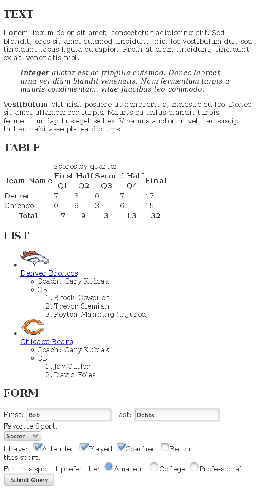

# HTML Assessment

### Week 6 - Weekend Homework Project for Skill Distillery

### Overview

The main objective of this weekend project is to get comfortable with creating a well-structured HTML document and adding elements to it,
without needing to Google the basic syntax and tag names.

### Learning Objectives

Complete Self-Study units from CodeCademy _[Learn HTML][Codecademy]_ course:
  * _HTML Elements and Structure: Introduction to HTML_
  * _HTML Elements and Structure: HTML Document Standards_
  * _HTML Tables: Tables_  

Build a fundamental understanding of the following HTML elements:
  * Basic HTML document structure
  * *Structural tags*: h1-h6, p, hr, blockquote, ul, ol, li, properly-nested lists.
  * *Links*: a, href.
  * *Images*: img, src, alt.
  * *Tables*: table, tr, th, td, colspan, rowspan.
  * *Forms*: form, input types, radio, checkbox, select/options, submit.

Complete the _Forms_ section of either the [Quackit][quackit] or [HtmlDog][Htmldog] tutorials (or both).

Create a web page that resembles:

### Technologies / Skills Used

* HTML  

### Lessons Learned

Gained practice with creating basic:
  * Tables
  * Forms

[Codecademy]: https://www.codecademy.com/learn/learn-html
[quackit]:http://www.quackit.com/html/tutorial/html_formatting.cfm
[Htmldog]: http://htmldog.com/guides/html/beginner/
